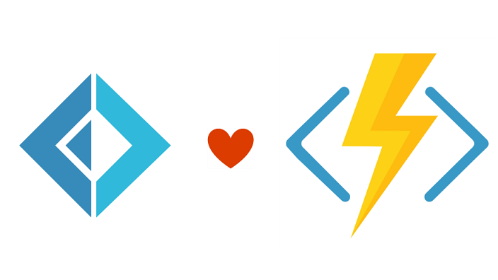
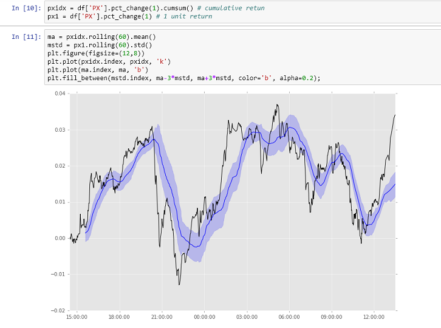

- title : Serverless meets F# and Bitcoin
- description : Azure Functions in F#
- author : Peter Veres
- theme : night
- transition : default

***
## Make today an easy day!
## 

> Less infrastructure + less code. 
' We continue our easy day series by looking at Azure Functions.
' For the previous slides see the link from the April Meetup
' Or directly: https://s952163.github.io/DotNetMeetup170418/

*** 

## Serverless meets F# and Bitcoin
  

' What can Functions be used for?

***

## Azure Functions  

- Great for short, non-memory intensive tasks that need to be triggered by:  

> timer, queue, http

- easy to hook  up to webapps, and leverage storage on Azure, will auto-scale
- No need to set up a VM or maintain a server
- Out of the box support for F#, fsx and compiled code (upload your dll, reference nuget packages)
-  Azure Functions are language agnostic but **F#** syntax is a natural fit 

> pipeline of small stateless functions  

' Easy to do Azure Functions in F#
' How easy?

***

## Super easy to get started

***

> Show me the code

' Show me the money

*** 

    [<CLIMutable>]
    type BitcoinRate = {
        PartitionKey: string
        RowKey: string
        Name: string
    }

    let getBitCoinPx() = 

        let url = """http://api.coindesk.com/v1/bpi/currentprice/USD.json"""
        use client =  new WebClient()
        let result = client.DownloadString(url)

        let json = JsonValue.Parse(result)
        let fx = (json?bpi?USD?rate_float).AsFloat()                                  
        let time = (json?time?updatedISO).AsDateTime()

        {PartitionKey = "Bitcoin"; RowKey = time.ToString("yyyy-MM-ddTHH:mm:ss"); 
         Name = fx.ToString()}

' F# code that defines a type: BitcoinRate, this is a simple DTO
' and a function: getBitCoinPx()
' this function polls the Bitcoin API, perses the json, and returns a BitcoinRate record
' Show the output of the function in VS2017 or VSCode

***

### Azure will execute the .fsx file, so the exact same code will be running:

***

The return type of this function is `unit -> BitcoinRate`

> Where does it go?

' Since our function is stateless, how can we store the current Bitcoin price??
' Yes, Azure Table Storage!

***

## Our second Function: Azure table storage

    let Run(bitcoinRate: BitcoinRate, 
            bitcoinOut: ICollector<BitcoinRate>, log: TraceWriter) =
        log.Info(sprintf "F# Queue trigger function processed: '%A'" bitcoinRate)
        bitcoinOut.Add(bitcoinRate)

' This is not strictly necessary, however it is possible to setup multiple functions watching the same queue, doing different things
' So the output of the first function goes into the queue (or ServiceBus), where another function is triggered, that places the item in the queue into Storage

***

## Part 2: Azure Notebooks

[Azure](https://notebooks.azure.com/) supports F#, Python and R in [Jupyter Notebooks](http://jupyter.org/)

> so no need to run your own notebook server
> or to install F# or python 

' So what can we do with all of this?
' It's data, let's analyze it    
    
***

## Python code below!

    from azure.storage.table import TableService
    # Set up credentials and Connect to the table using our key  
    key = 'verySecret'
    serviceName = 'bitcoinfunabcb'
    table_service = TableService(serviceName, key)

    # Query the table by filtering on the PartitionKey and other items
    queried_entities = table_service.query_entities('bitcoinTable', 
        filter="RowKey gt '2017-06-16T14:26:00' and PartitionKey eq 'Bitcoin'")

' this code will return 1000 rows
' to return everything process the continuation token in  a loop

***

## Literate Programming

' all kinds of analysis can be performed interactively with rapid prototyping
' finally it can be put into production
' Last slide list some useful F# resources

***

### Libraries/Tools/Resources

* All the .NET BCL and 
* Some personal picks
    - [F# Slack](http://foundation.fsharp.org/join): Quite active and friendly
    - [Fable](http://fable.io/): F# to JavaScript (you can be proud of)
    - [FSharp.Data](http://fsharp.github.io/FSharp.Data/) and [SQLProvider](http://fsprojects.github.io/SQLProvider/): micro-ORM/typed data access
    - [Suave](https://suave.io/): an async micro web-server
    - [Paket](https://fsprojects.github.io/Paket/index.html): dependency management
    - [Fake](http://fsharp.github.io/FAKE/): build tool
    - [Expecto](https://github.com/haf/expecto): first-class tests
    - [MathNet.Numerics](https://numerics.mathdotnet.com/): numerical/statistical computations
    - [Gjallarhorn](http://reedcopsey.github.io/Gjallarhorn/): managing mutable state and signals
    - [Oxyplot](http://www.oxyplot.org/): plotting library
    - [Argu](http://fsprojects.github.io/Argu/) and [CommandLine](https://github.com/gsscoder/commandline): command line parsers
    - [BenchmarkDotNet](http://benchmarkdotnet.org/): easy micro benchmarking
    - [FileHelpers](http://www.filehelpers.net/): processing delimited files

***

### 
* **Fake:** F# Make, a build tool for .NET  
* Integrated DSL in F#  
* Run tests, add assembly info, release to nuget via Paket  

###   
* **Paket:** dependency manager for .NET 
* Integrated with nuget but much more reliable
* Can reference source files, github

***

### Resources
* Web:
    * [.NET Docs](https://docs.microsoft.com/en-us/dotnet/articles/fsharp/)
    * [F# for Fun & Profit](https://fsharpforfunandprofit.com/)
    * [F# Guide for C# devs](http://connelhooley.uk/blog/2017/04/10/f-sharp-guide)
* Books:
    * [Expert F# 4.0](http://www.apress.com/us/book/9781484207413)
    * [Learn F#](https://www.manning.com/books/learn-fsharp)
    * [Functional Concurrency in .NET](https://www.manning.com/books/functional-concurrency-in-dotnet)
* Slack:
    * [FSharp Slack](http://foundation.fsharp.org/join)
    * [F# channel on FP Slack](https://functionalprogramming.slack.com)
* Videos:
    * [Channel 9: Intro to F#](https://channel9.msdn.com/blogs/pdc2008/tl11)
    * [Channel 9: F# in VS2017](https://channel9.msdn.com/blogs/pdc2008/tl11)
    * [Functional Design Patterns](https://youtu.be/E8I19uA-wGY)
    * [FSharp Exchange 2017](https://skillsmatter.com/explore?q=tag%3Afsharpx)

*** 

### Coding in F#

    

<iframe src="//giphy.com/embed/aq6Thivv9V9lu?html5=true" width="480" height="272.23880597014925" frameBorder="0" class="giphy-embed" allowFullScreen></iframe>

<! ### >

***